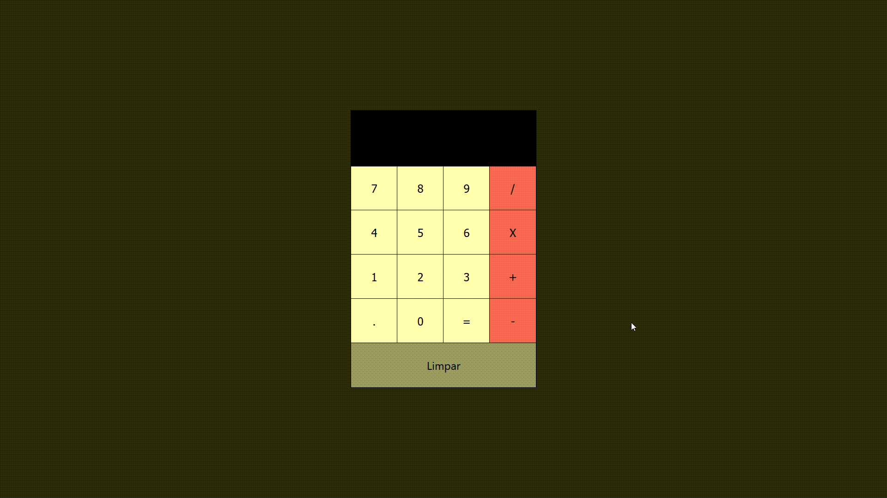

# Calculator
Calculadora simples usando react.

  

## Decription
Usando react desenvolvi uma calculadora simples usando a biblioteca [MathJS](https://mathjs.org/) para fazer operações simples.

## Api's and Library
+ [MathJS](https://mathjs.org/)

**_This project was bootstrapped with [Create React App](https://github.com/facebook/create-react-app)._**

